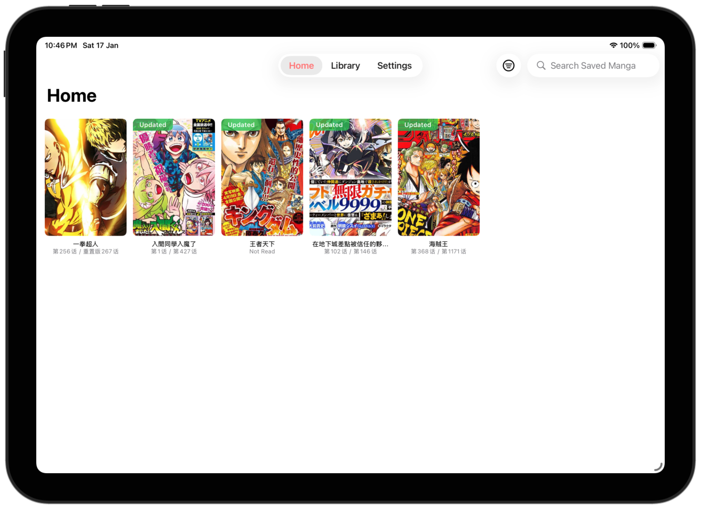
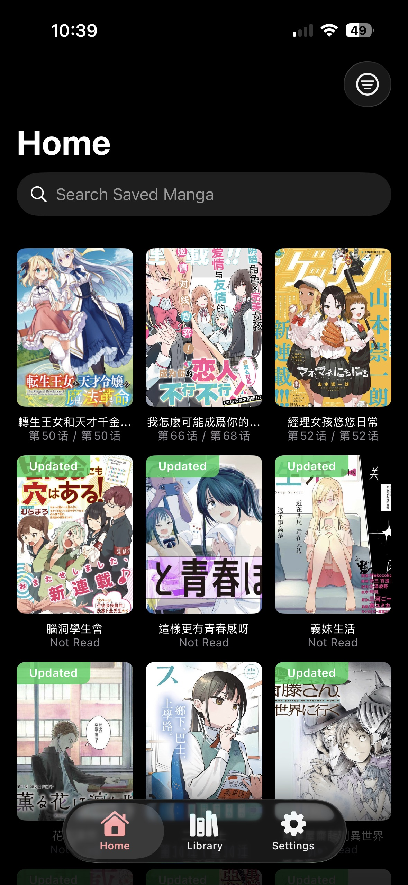
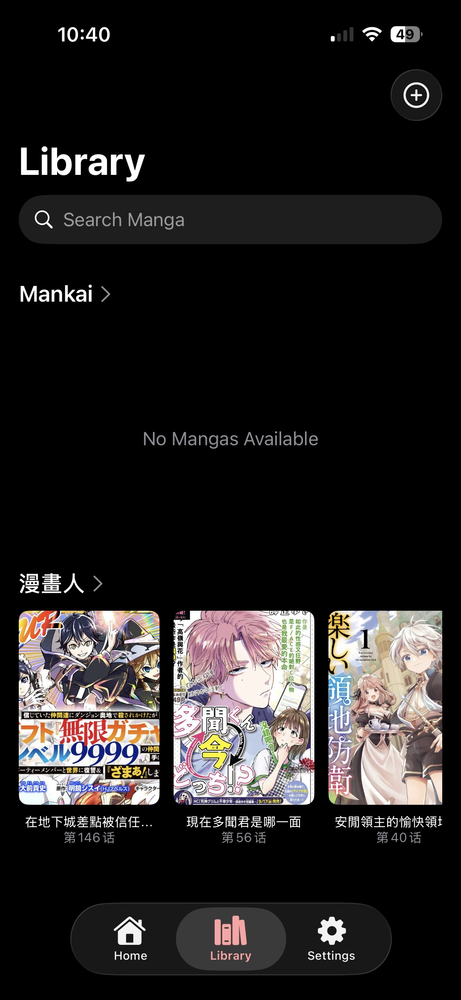
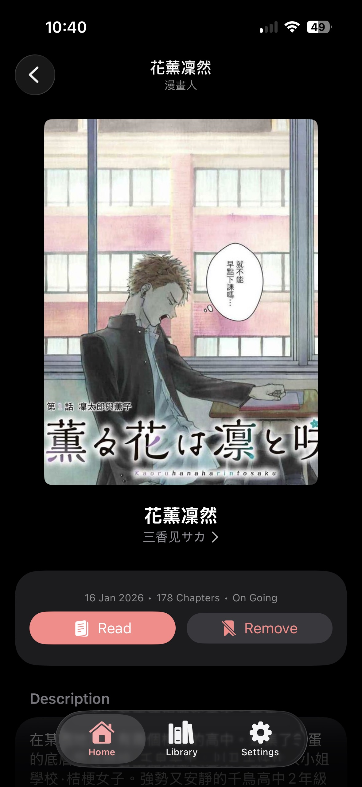
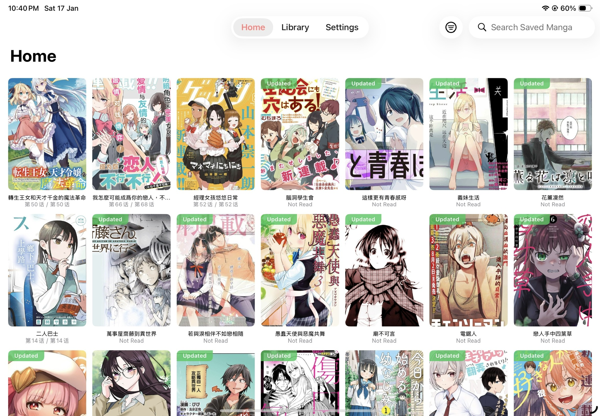
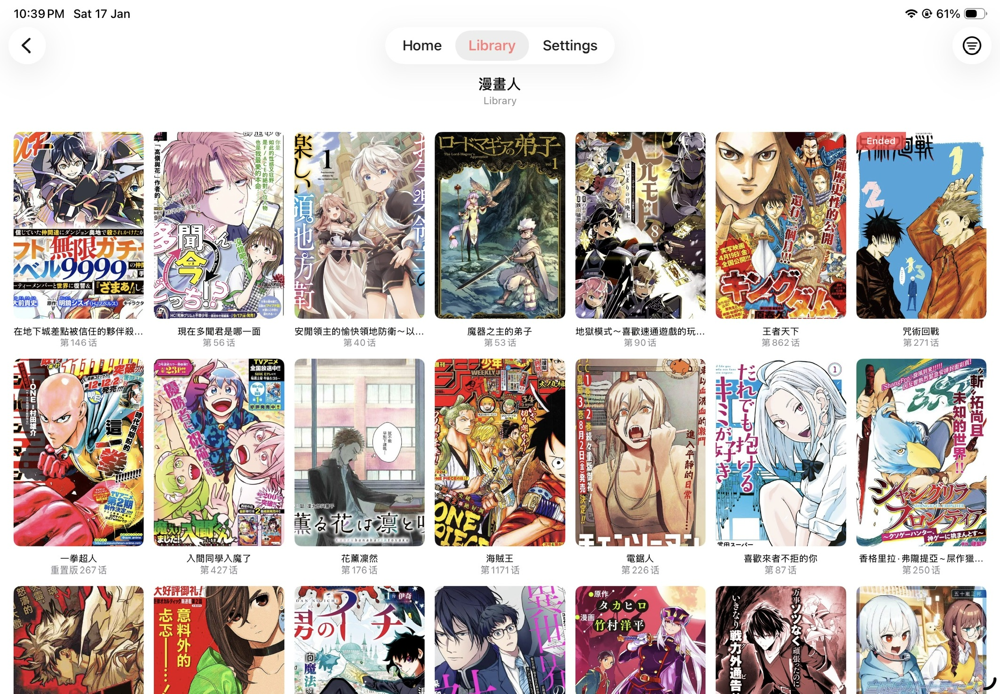
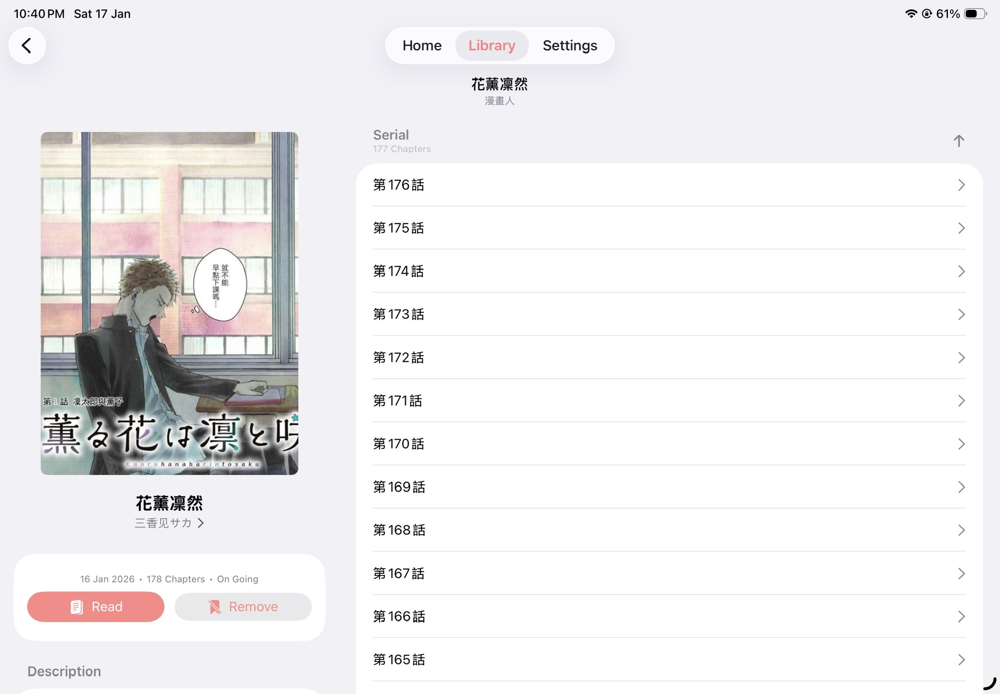

> [!WARNING]
> This project is currently under active development. Many details are still being finalized.

> [!IMPORTANT]
> Mankai does not provide, host, or distribute any media content. Users are responsible for obtaining media through legal means and complying with their local laws. Any plugins used with the app are unaffiliated with Mankai, and we have no control over them.

# Mankai

<!--  -->

Mankai is a powerful and extensible manga reader for iPhone and iPad, written in Swift. It features a **plugin system** for multi-source support (JavaScript, filesystem, and HTTP), **library management** to organize your collection, **reading history** tracking, and a **modern UI** built with SwiftUI.

More Screenshots

### iPhone

|               Home               |                Library                 |                Details                 |
| :------------------------------: | :------------------------------------: | :------------------------------------: |
|  |  |  |

### iPad

|              Home              |               Library                |               Details                |
| :----------------------------: | :----------------------------------: | :----------------------------------: |
|  |  |  |

## Plugins

Mankai is designed to be extensible. It supports three types of plugins, each serving a distinct function:

### JavaScript Plugin (JsPlugin)

This plugin scrapes content from third-party manga websites, allowing you to browse and read manga from various online aggregators directly within the app.

- **Plugins Examples**: [mankai-plugins](https://github.com/nohackjustnoobb/mankai-plugins)

### File System Plugin (FsPlugin)

This plugin manages manga stored as local files stored on your device or a connected service.

- **Syncing**: Point it to a folder in iCloud Drive or other remote storage solutions (e.g., SMB) to sync your library across devices.

### Http Plugin (HttpPlugin)

This plugin is designed for external providers to use Mankai as a reader and, optionally, an editor. It connects to servers implementing the standard API and supports authentication.

- **Specification**: [Mankai API Specification](https://github.com/nohackjustnoobb/mankai-server/blob/master/doc/api.md)
- **Reference Server**: [mankai-server](https://github.com/nohackjustnoobb/mankai-server)

## Syncing

Mankai supports syncing your library and reading history across devices using the following sync engines:

### HttpEngine

The **HttpEngine** requires a self-hosted server to function. You can host the server yourself using the [mankai-sync](https://github.com/nohackjustnoobb/mankai-sync) repository.

Once hosted, you can configure the server URL in the app settings to enable syncing.

### SupabaseEngine

The **SupabaseEngine** allows you to sync using Supabase as the backend. You can set up your own Supabase project using the database schema provided in the [mankai-supabase](https://github.com/nohackjustnoobb/mankai-supabase) repository.

Once configured, you can enter your Supabase URL and Key in the app settings to enable syncing.

### Planned Sync Engines

- **iCloud** - Pending availability of resources (aka. I have no money)

## Development Notes

**Performance with Debugger Attached (e.g., from Xcode):**

- The startup time will be significantly slower than normal.
- The app may temporarily freeze on the first scroll in the reader screen.

These issues do not occur when running the app without a debugger attached.
